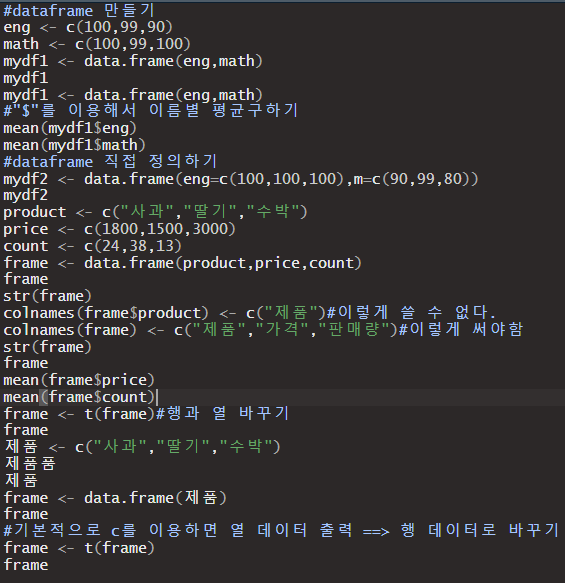

## R - 데이터분석

#### RStudio 기본

1) 연산자/함수

2) 데이터 구조

- 벡터 : 1차원으로 구성된 데이터 구조, 한 가지 변수 타입으로 구성된다.

  

- 매트릭스 : 행과 열로 구성된 2차원 데이터 구조, 한 가지 변수 타입으로 구성된다.

  

- 데이터 프레임 : 행과 열로 구성된 2차원 데이터 구조, 열마다 다양한 변수 타입으로 구성할 수 있다.

  

  

- 리스트 : 2차원 가변배열

  

- 어레이

  

3) 데이터 제어

- for문

  

- if문

  

4) 데이터 가져오기/내보내기

